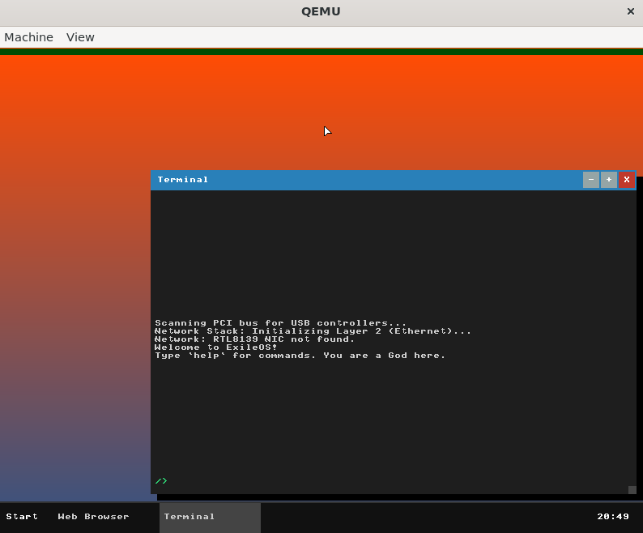

# ExileOS


## Introduction

ExileOS is a 32-bit hobby operating system built from scratch. It is designed to boot via GRUB (Multiboot standard) and features a graphical user interface, a window manager, and a suite of basic applications. The project serves as an educational exploration into operating system development, covering concepts from bootloading and interrupt handling to filesystems and graphical user interfaces.

## Contributing to the project

If you would like to contribute to the project, I am looking for some developers who are as passionate about OS development as I am.

## Features

- **Kernel**: 32-bit protected mode kernel.
- **Bootloader**: Uses GRUB with the Multiboot 1 specification.
- **Graphics**: 1920x1080, 32-bit color graphical mode with a double-buffered display driver.
- **Window Manager**: A stacking window manager supporting multiple overlapping and draggable windows.
- **GUI**:
    - Gradient desktop background with a wallpaper toggle. 
    - Taskbar with a Start Menu and a real-time clock (RTC).
- **Filesystem**: A hybrid VFS combining a read-only TAR-based initial RAM disk (initrd) with a writable in-memory filesystem for creating new files and directories.
- **Drivers**:
    - PS/2 Keyboard
    - PS/2 Mouse
    - Real-Time Clock (RTC)
- **Applications**:
    - **Terminal**: A command-line shell with support for commands like `ls`, `cd`, `mkdir`, `cat`, `echo`, `ver`, and `reboot`.
    - **File Manager**: A graphical utility to browse the filesystem and open files.
    - **Text Editor**: A simple line-based text editor.
    - **Calculator**: A basic arithmetic calculator.
    - **System Monitor**: Displays CPU, memory, and resolution information.
    - **Settings**: Allows for basic system configuration, such as changing the wallpaper.
    - **About**: Displays information about the OS.

## Building from Source

### Dependencies

To build and run ExileOS, you will need a standard Linux environment (such as Ubuntu/Debian, I used Linux Mint) with the following tools installed:

- `build-essential` (provides `make` and `gcc`)
- `nasm` (Netwide Assembler)
- `gcc-multilib` (for 32-bit compilation on 64-bit systems)
- `grub-mkrescue` (often part of `grub2-common` or `grub-common`)
- `qemu-system-i386` (for running the OS)

You can typically install these on a Debian-based system with:
```sh
sudo apt-get update
sudo apt-get install build-essential nasm gcc-multilib qemu-system-i386 grub-common
```

### Build Instructions

Navigate to the root directory of the project and run the `make` command.

```sh
make
```

This will compile the kernel, create the initial RAM disk, and package everything into a bootable ISO file named `ExileOS.iso`.

## Running

To run the operating system in an emulator, use the provided `run` target in the Makefile.

```sh
make run
```

This will launch QEMU with the `ExileOS.iso` file as a virtual CD-ROM.

To clean up all build artifacts, run:
```sh
make clean
```

